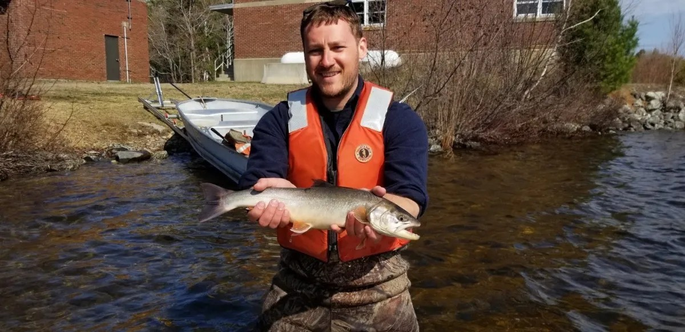
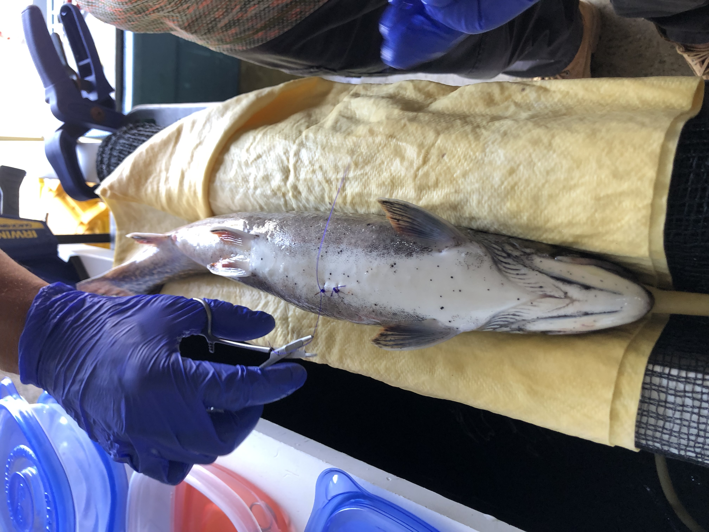
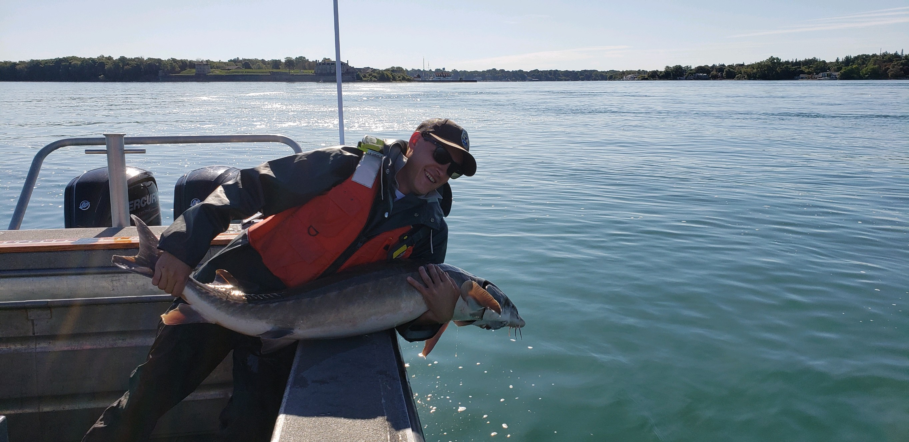
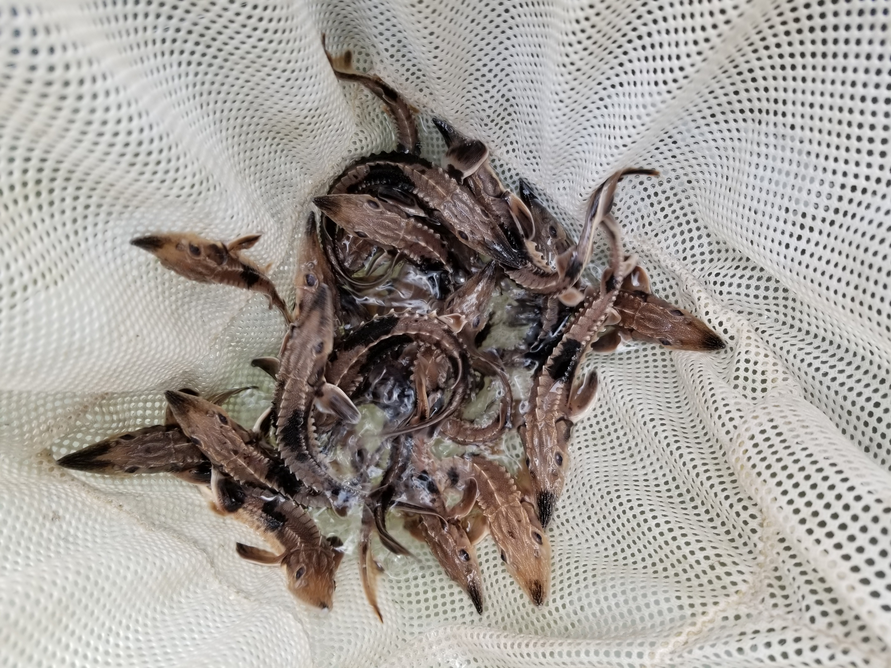
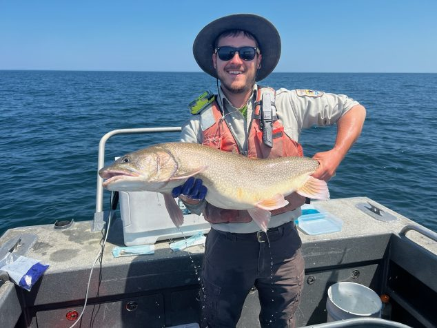
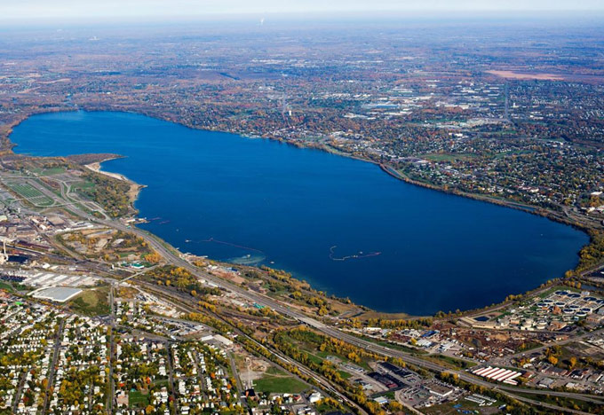
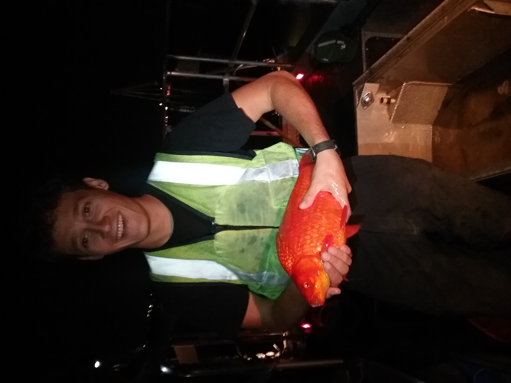

## Arctic Charr and Climate Change
#### PhD Dissertation at UMaine, Orono, ME


{width=72%}  {width=26%}

\ 

My research at the University of Maine revolves around the climate resilience of Arctic Charr (*Salvelinus alpinus*). The southern-most populations in North America occur in Maine, all of which are lacustrine rather than diadromous like many Alaska, Canadian, and European populations. These populations are glacial relicts and may be especially vulnerable to warming climate due.

I'm studying the demography, population trends, and habitat associations of the Arctic Charr living in Floods Pond, the best-studied population in Maine. For my first dissertation chapter, I am using a long-term mark-recapture dataset to model their survival and estimate the spawning population size. My goal is to then relate any trends in these metrics to possible environmental drivers, especially those with relevance to climate change.

However, my primary research revolves around the seasonal habitat use of Arctic Charr in Floods Pond using acoustic telemetry. I have surgically implanted 30 charr with tags that transmit a signal every 3 minutes and can estimate their locations with high precision (typically <10m). My latter dissertation chapters evaluate seasonal habitat use, diet, and bioenergetics these tagged charr, as well as interactions with sympatric Brook Trout (*Salvelinus fontinalis*), 12 of which have also been tagged.


\ 

***

## Movement Ecology and Restoration of Lake Sturgeon & Lake Trout
#### US Fish and Wildlife Service at Lower Great Lakes FWCO, Basom, NY


{width=60%} {width=39%}


<div class = "row">

<div class = "col-md-6">

Before Maine, I spent several years working on the recovery of Lake Sturgeon (*Acipenser fulvescens*) in the Lake Ontario basin, where they are a species listed as threatened in New York and endangered in Ontario waters. Using long-term passive acoustic telemetry and interagency PIT taggin records, I described lake-wide movement patterns, habitat use, and behavior in the Niagara River and across management units in New York. I also advised and assisted the St. Regis Mohawk Tribe with the evaluation of Lake Sturgeon river movements following dam removal.

In addition, I assisted USGS and NYSDEC with projects to restore the native populations of Lake Trout (*Salvelinus namaycush*) and Cisco (*Coregonus artedi*) in Lake Ontario and Lake Erie. These included stocking, acoustic telemetry, and spawning site surveys. 


</div>

<div class = "col-md-6">

```{r echo=FALSE, fig.cap = "Lake Sturgeon ", fig.show='hold', fig.align='center', out.width = "400px"}

# figure width maxes out at out.width = "400px" to prevent overcrowding text




```
</div>
</div>


\ 

***


## Fish communities in a recovering urban lake
#### MS Thesis at SUNY Environmental Science and Forestry, Syracuse, NY


{width=65%} {width=34%}
\ 

For my Master's research at SUNY ESF, I studied ecological succession of a fish assemblage as a heavily polluted system recovered. Onondaga Lake in Syracuse, New York was once among the most contaminated lakes in the country. I compared fish species richness and diversity using gill net and trap net data collected throughout the remediation process to track how the community responded to restoration efforts. In short, I found that there was a significant decrease in nearshore fish diversity that seemed to correlate with the establishment of an aggressive invasive macroalgae. Interestingly, the decrease in diversity was due to the proliferation of some preyfish species, such as Banded Kilifish and Round Goby, which may have been able to better hide from predators within the algae mats. 
